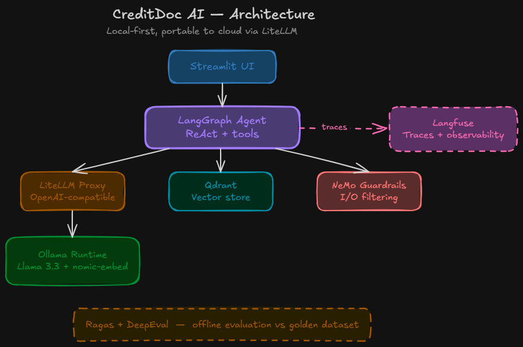

# CreditDoc AI — Architecture

## One-sentence summary

Everything runs locally; LiteLLM guarantees portability to the cloud
without changing a line of application code.

## Component view



## Runtime loop

1. User submits a question in Streamlit UI.
2. LangGraph agent decides what to do — retrieve, compute, or escalate.
3. On retrieval: agent calls Qdrant, gets top-k chunks, filtered by metadata.
4. NeMo Guardrails checks input/output for PII, out-of-scope, jailbreak attempts.
5. Agent sends enriched prompt to LLM via LiteLLM → Ollama (local) or Bedrock (cloud).
6. Answer returned to UI; full trace sent to Langfuse.

## Portability

The entire runtime is portable local ↔ cloud through LiteLLM. Switching
is a single `.env` change:

```
# Local (default)
LITELLM_MODEL=ollama/llama3:8b

# Cloud
LITELLM_MODEL=bedrock/anthropic.claude-sonnet-4-5
```

No application code changes.

## Offline components

- **Ragas + DeepEval**: run outside the runtime loop, against a versioned
  golden dataset in `eval/golden_dataset.jsonl`. Executed on-demand or
  in CI, never during a user session.
- **Langfuse**: receives traces asynchronously; the runtime does not
  block on observability writes.

## Trade-offs

| Choice | Why | Trade-off |
| --- | --- | --- |
| Qdrant over pgvector | Closer to production vector DBs (Pinecone, OpenSearch) | One more service to run |
| LangGraph over bare LangChain | Stateful agents, native branching, replay | Steeper learning curve |
| LiteLLM everywhere | Portability without rewrites | Thin layer of indirection to debug |
| Local-first | Zero cloud spend, works offline for demos | Model quality trails frontier models |

## Not yet implemented (status Week 1)

- The agent and tools 
- Guardrails integration 
- Evaluation pipeline 
- Advanced retrieval patterns 